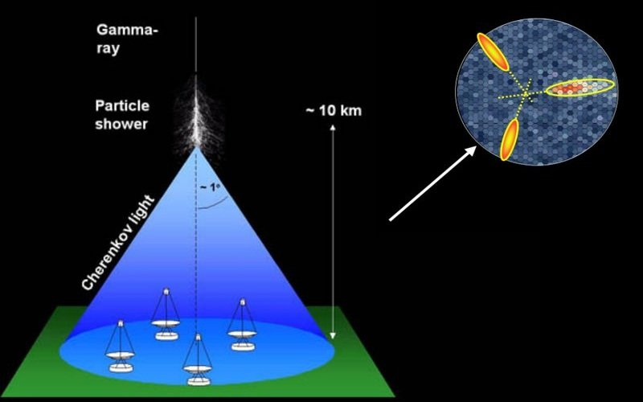

# Lesson 01: Introduction to Machine Learning with the MAGIC Gamma Telescope Dataset

**File:** `lessons/lesson01_introduction.md`  
**Data file:** `magic04.data` (in repo root)  
**Companion Notebook:** `fcc_MAGIC_example.ipynb`  
**Author:** Rorn Hangsovoleak  

---

## Instruction (សេចក្តីណែនាំ)

**How to use this lesson:**  
- Read the **English** section first, then read the **Khmer** section below.  
- This lesson explains the **concepts and big picture** of the project.  
- Keep `fcc_MAGIC_example.ipynb` open at the same time — you will see the real Python code that matches what we explain here.  
- Open `magic04.data` with any text editor or run the notebook to explore the data.  
- Download the images and save them in the `images/` folder so they display correctly on GitHub.  

**What you need:**  
- A web browser  
- This `.md` file  
- Jupyter Notebook (Google Colab or VS Code) to run the example notebook  

**Goal:** Easy to understand for beginners, clear explanations, and bilingual support.

---

## English Version

### Introduction
The **MAGIC Gamma Telescope** dataset is a real scientific dataset from the UCI Machine Learning Repository. It was created by simulating high-energy particle showers detected by the MAGIC Cherenkov telescope in La Palma, Spain.

Scientists use this data to **automatically distinguish**:
- **Gamma rays (`g`)**: Valuable signals coming from space (used to study galaxies, black holes, etc.).
- **Hadron showers (`h`)**: Background noise from cosmic rays (not useful).

**Dataset Information:**
- Total rows: 19,020
- 10 numerical features: `fLength`, `fWidth`, `fSize`, `fConc`, `fConc1`, `fAsym`, `fM3Long`, `fM3Trans`, `fAlpha`, `fDist`
- Target (class): `g` (gamma, 12,332 samples) or `h` (hadron, 6,688 samples)
- No missing values
- Task: **Supervised Binary Classification**

  
*Image: The MAGIC telescope captures Cherenkov light from particle showers. Gamma rays and hadrons create different light patterns.*

### The Problem
Every night, telescopes record thousands of particle shower images.  
- Gamma rays contain important scientific information.  
- Hadron showers are mostly unwanted noise.  

Checking all images manually is impossible. We need a computer that can **automatically classify** each shower using the 10 measured features.

### The Solution
We use **Supervised Machine Learning**.  
We train a model with labeled examples (`g` or `h`). The model learns patterns from the features and can then predict the correct class for new, unseen data.

This is a **binary classification** problem (only two possible answers: gamma or hadron).

### What You Will Learn & Gain
- Clear understanding of Machine Learning fundamentals using real scientific data.  
- Ability to explain the difference between AI, ML, and Data Science.  
- Knowledge of how Machine Learning is used in real astronomy research.  
- Strong foundation to build, train, and evaluate your own models (in later lessons).  
- Practical skills useful for data science, research, or Kaggle competitions.  
- Bilingual notes so you can teach or discuss in Khmer.

### Connection to the Notebook (`fcc_MAGIC_example.ipynb`)
In the notebook you will see the first practical steps:
- Loading the data using pandas
- Converting the class label from text (`g`/`h`) to numbers (`1`/`0`)

**Important code example from the notebook:**
```python
import pandas as pd

cols = ["fLength", "fWidth", "fSize", "fConc", "fConc1", "fAsym",
        "fM3Long", "fM3Trans", "fAlpha", "fDist", "class"]

df = pd.read_csv("magic04.data", names=cols)

# Convert class: g → 1 (gamma), h → 0 (hadron)
df["class"] = (df["class"] == "g").astype(int)

print(df.head())
This conversion is necessary because most machine learning models work with numbers, especially when using Binary Cross-Entropy loss.
What is Machine Learning?
Machine Learning is a branch of computer science that allows computers to learn patterns from data without being explicitly programmed for every rule.
AI vs ML vs DS


Artificial Intelligence (AI): The broad goal of making machines behave intelligently like humans.
Machine Learning (ML): A subset of AI that learns from data to make predictions.
Data Science (DS): Focuses on extracting insights and patterns from data (often uses ML).

These three fields overlap a lot.
Types of Machine Learning


Supervised Learning — Uses labeled data (we know the correct answer). This is what we use for the MAGIC dataset.
Unsupervised Learning — Finds hidden patterns in data without labels.
Reinforcement Learning — An agent learns by receiving rewards or penalties.

Supervised Learning Tasks

Classification: Predict categories (e.g., gamma or hadron).
Regression: Predict continuous numbers (e.g., price, temperature).

Features
All 10 features in this dataset are numerical (continuous values). There are no text or category features.
Loss Functions
We measure how wrong the model is using a loss function.
For binary classification (2 classes), we commonly use Binary Cross-Entropy Loss:
[ \text{BCE} = - [ y \log(\hat{y}) + (1-y) \log(1 - \hat{y}) ] ]
Lower loss means better performance.

Performance Metrics
Accuracy = (Correct predictions) / (Total predictions)
[ \text{Accuracy} = \frac{TP + TN}{TP + TN + FP + FN} ]
Because the dataset is slightly imbalanced (more gamma than hadron), we should also look at the Confusion Matrix.


Khmer Version (កំណែភាសាខ្មែរ — ងាយយល់ និងភ្ជាប់ជាមួយកូដ)
សេចក្តីណែនាំ
សំណុំទិន្នន័យ MAGIC Gamma Telescope គឺជាទិន្នន័យពិតប្រាកដមកពី UCI Machine Learning Repository។ វាត្រូវបានបង្កើតឡើងដោយក្លែងធ្វើការងូតទឹកភាគល្អិតថាមពលខ្ពស់ដែលរកឃើញដោយកាំរស្មី MAGIC Cherenkov នៅ La Palma ប្រទេសអេស្ប៉ាញ។
អ្នកវិទ្យាសាស្ត្រប្រើទិន្នន័យនេះដើម្បី ចែកថ្នាក់ស្វ័យប្រវត្តិ៖

g = ហ្គាម៉ា (signal មកពីលំហ — មានតម្លៃខ្ពស់សម្រាប់ការសិក្សា)
h = ហាដ្រុង (noise ឬសំលេងរំខាន — មិនមានតម្លៃ)

ព័ត៌មានសំខាន់៖

សរុប ១៩០២០ ជួរ
មាន ១០ លក្ខណៈជាលេខ
ថ្នាក់៖ g (១២៣៣២ ករណី) និង h (៦៦៨៨ ករណី)
គ្មានទិន្នន័យបាត់
កិច្ចការ៖ Supervised Binary Classification

បញ្ហា
កាំរស្មីតារាវិទ្យាទទួលបានរូបភាពរាប់ពាន់រាត្រី។

Gamma = ទិន្នន័យវិទ្យាសាស្ត្រដែលមានតម្លៃ។
Hadron = សំលេងរំខានដែលមិនចង់បាន។

ការពិនិត្យដោយដៃមិនអាចទៅរួចទេ។ យើងត្រូវកុំព្យូទ័រចែកថ្នាក់ដោយប្រើ ១០ លក្ខណៈ។
ដំណោះស្រាយ
យើងប្រើ Supervised Machine Learning។
យើងផ្តល់ទិន្នន័យមានស្លាក (g ឬ h) ទៅកុំព្យូទ័រ ដើម្បីឱ្យវារៀនគំរូ រួចទស្សន៍ទាយថ្នាក់ថ្មីបាន។
នេះជា binary classification (មានតែ ២ ថ្នាក់ប៉ុណ្ណោះ)។
អ្វីដែលអ្នកនឹងទទួលបាន

យល់ច្បាស់ពីមូលដ្ឋាននៃ Machine Learning ដោយប្រើទិន្នន័យពិត។
អាចពន្យល់ភាពខុសគ្នារវាង AI, ML និង Data Science ជាភាសាខ្មែរ។
ដឹងពីការប្រើប្រាស់ ML ក្នុងវិទ្យាសាស្ត្រតារា។
មានមូលដ្ឋានរឹងមាំសម្រាប់ការសាកល្បងម៉ូដែលផ្ទាល់ខ្លួននៅមេរៀនបន្ទាប់។

ភ្ជាប់ជាមួយកូដនៅក្នុង Notebook
នៅក្នុង fcc_MAGIC_example.ipynb អ្នកនឹងឃើញជំហានដំបូង៖

ផ្ទុកទិន្នន័យដោយប្រើ pandas
ប្តូរស្លាកពីអក្សរ (g/h) ទៅលេខ (1/0)

កូដសំខាន់៖
Pythonimport pandas as pd

cols = ["fLength", "fWidth", "fSize", "fConc", "fConc1", "fAsym",
        "fM3Long", "fM3Trans", "fAlpha", "fDist", "class"]

df = pd.read_csv("magic04.data", names=cols)

# ប្តូរស្លាក g → 1, h → 0
df["class"] = (df["class"] == "g").astype(int)

print(df.head())
ការប្តូរស្លាកនេះមានសារៈសំខាន់ ព្រោះម៉ូដែលភាគច្រើនត្រូវការលេខ ជាពិសេសនៅពេលប្រើ Binary Cross-Entropy Loss។

Machine Learning គឺជាអ្វី?
Machine Learning គឺជាផ្នែកមួយនៃវិទ្យាសាស្ត្រកុំព្យូទ័រ ដែលធ្វើឱ្យកុំព្យូទ័ររៀនពីទិន្នន័យ ដោយមិនត្រូវការសរសេរក្បួនច្បាស់លាស់ទាំងអស់។
AI vs ML vs DS


AI៖ ធ្វើឱ្យម៉ាស៊ីនឆ្លាតវៃដូចមនុស្ស។
ML៖ ផ្នែកតូចមួយនៃ AI — ប្រើទិន្នន័យដើម្បីទស្សន៍ទាយ។
DS៖ រកគំរូ និងចំណេះដឹងពីទិន្នន័យ (ជាញឹកញាប់ប្រើ ML)។

ប្រភេទនៃ Machine Learning


Supervised — ប្រើទិន្នន័យមានស្លាក (នេះជាប្រភេទដែលយើងប្រើសម្រាប់ MAGIC)។
Unsupervised — រកគំរូដោយគ្មានស្លាក។
Reinforcement — រៀនពីរង្វាន់ និងការពិន័យ។

កិច្ចការក្នុង Supervised Learning

Classification៖ ទស្សន៍ទាយថ្នាក់ (ឧ. g ឬ h)។
Regression៖ ទស្សន៍ទាយលេខ (តម្លៃ សីតុណ្ហភាព ជាដើម)។

លក្ខណៈទិន្នន័យ (Features)
ទាំង ១០ លក្ខណៈគឺជាលេខទាំងអស់ (មិនមានអក្សរ)។
មុខងារបាត់បង់ (Loss Function)
យើងវាស់កំហុសម៉ូដែលដោយ Binary Cross-Entropy។ តូចជាង = ល្អជាង។
វិធានវាស់សមត្ថភាព
Accuracy = ចំនួនត្រឹមត្រូវ / ចំនួនសរុប
ដោយសារទិន្នន័យមានភាពមិនស្មើគ្នា (g ច្រើនជាង h) យើងក៏ត្រូវមើល Confusion Matrix ផងដែរ។

ចប់មេរៀនទី១
បន្តទៅ មេរៀនទី២៖ Data Loading & Exploration
Happy learning! 🚀
